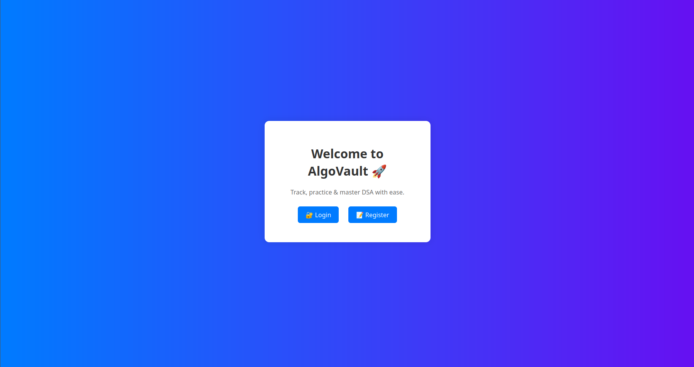
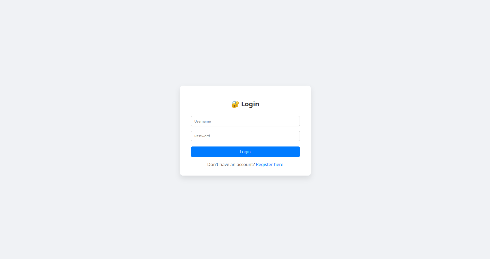
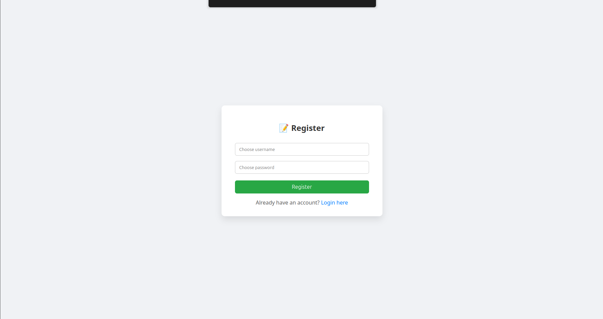
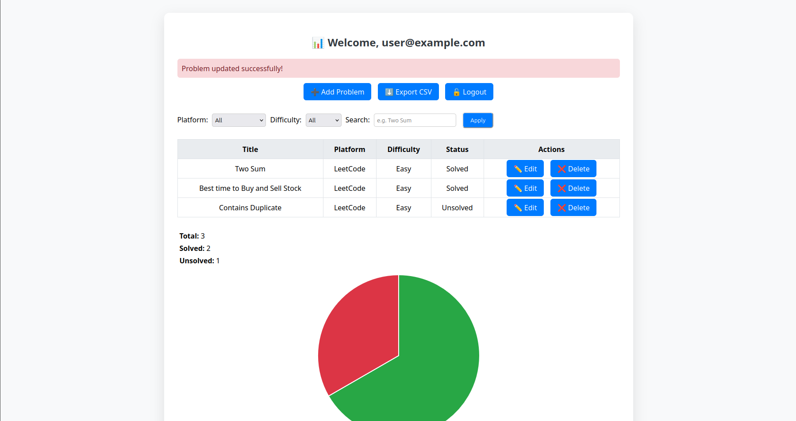
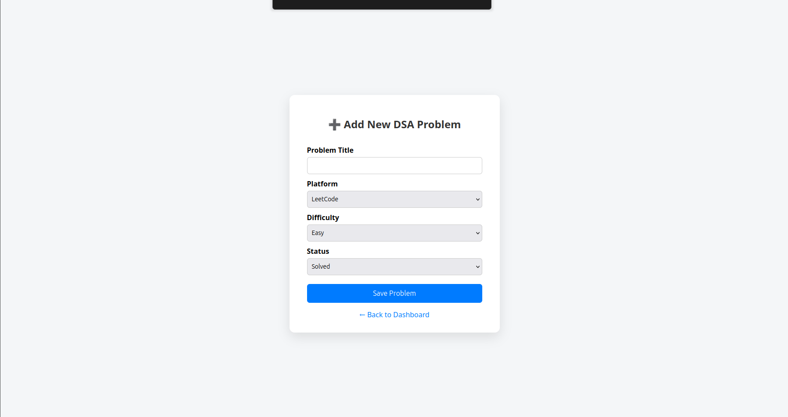
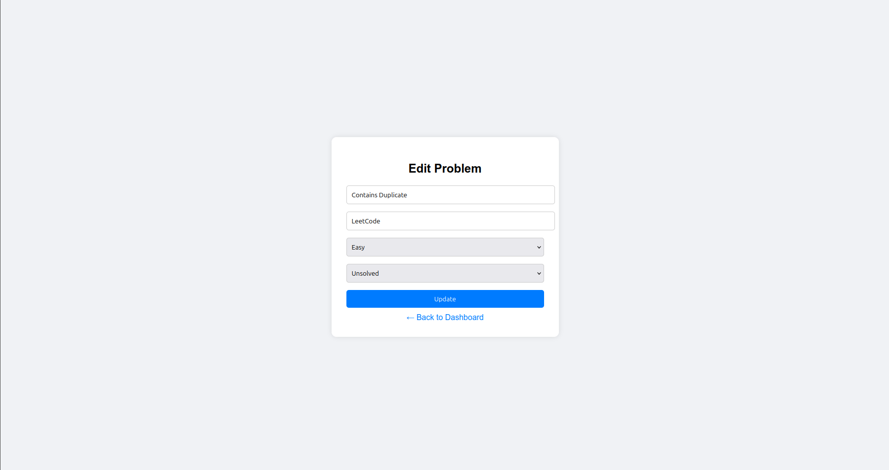

# 🧠 AlgoVault – DSA Tracker & Progress Visualizer

AlgoVault is a simple yet powerful web application for tracking DSA (Data Structures and Algorithms) problems. It helps you log, filter, edit, and visualize your DSA practice across multiple platforms.

<br>

## 🚀 Features

- ✅ User Registration & Secure Login
- 📋 Add/Edit/Delete DSA problems
- 🔍 Filter by platform & difficulty
- 📈 Track total, solved, unsolved
- 📤 Export your progress as CSV
- 🧠 Visualize progress using charts (Chart.js)
- 📱 Clean, portal-style responsive UI
- ⚠️ Flash messages for alerts, errors

<br>

## 🛠 Tech Stack

| Layer        | Tools Used         |
|--------------|-------------------|
| Backend      | Python, Flask     |
| Database     | SQLite            |
| Frontend     | HTML, CSS, Chart.js |
| Auth         | Flask-Login       |
| Export       | CSV module        |

<br>

## 📸 Screenshots

#### 🏠 Home Page  


#### 🔐 Login Page  


#### 📝 Register Page  


#### 📋 Dashboard Page  


#### ➕ Add Problem Page  


#### ✏️ Edit Problem Page  



- Login / Register Portal  
- Dashboard with filters & chart  
- Problem editing form  

<br>

## 🚦 Usage

1. Clone the repo  
```bash
git clone https://github.com/your-username/algovault.git
cd algovault
